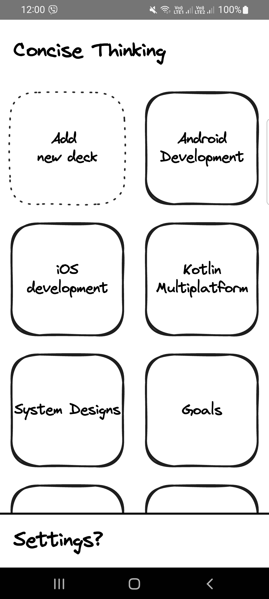
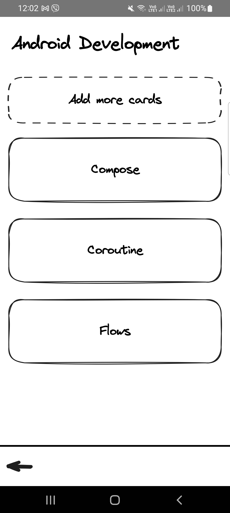
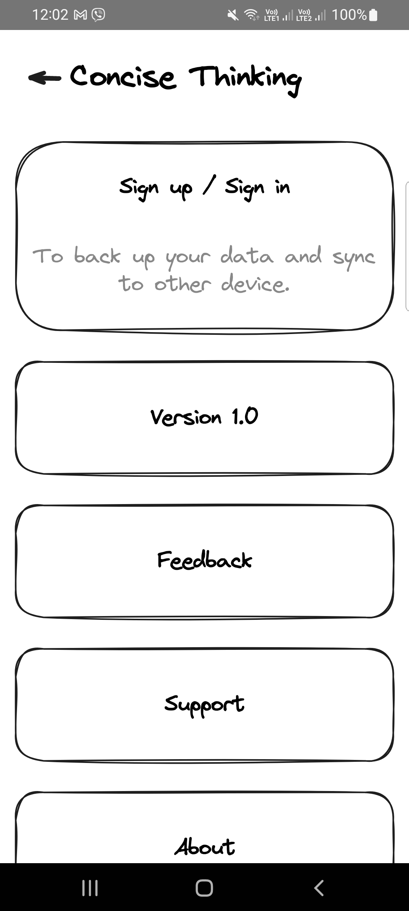
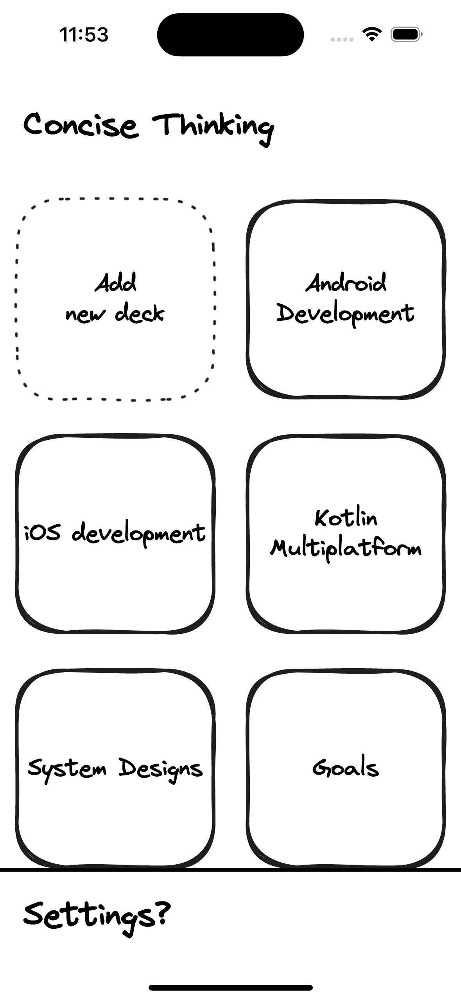
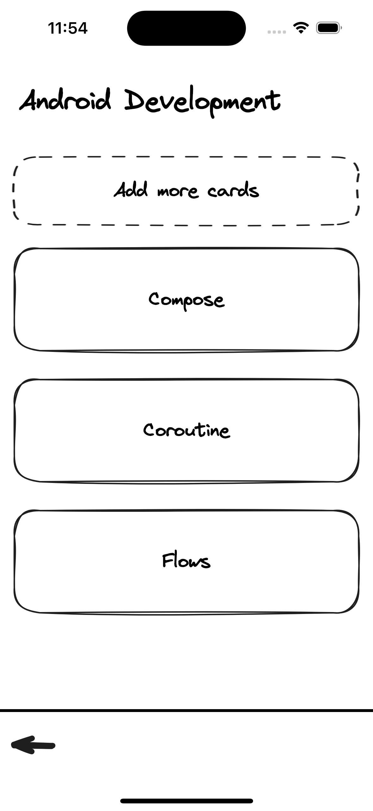
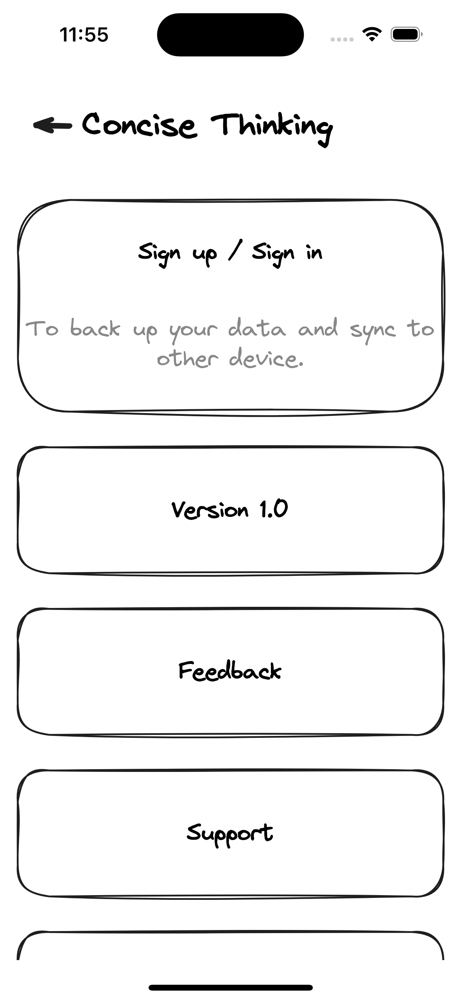
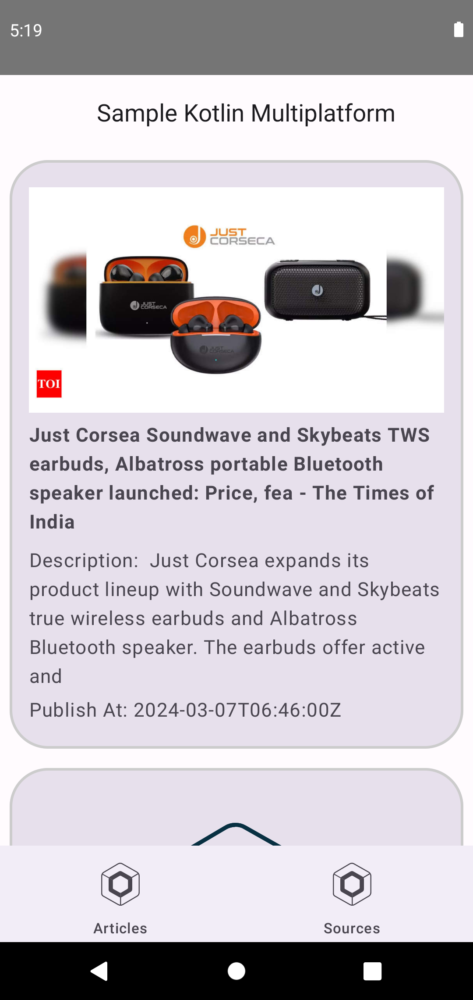
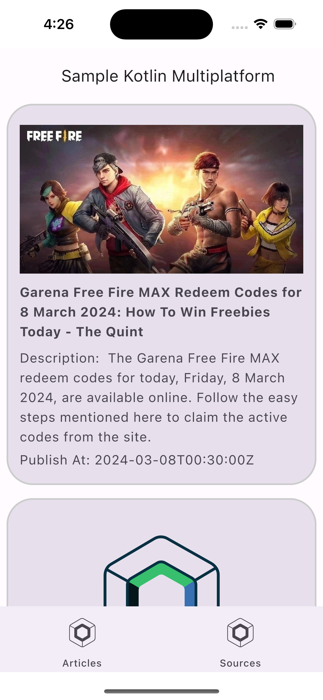

### Hi! I'm Stephen！ 👋 ###

- 🔭 I’m currently working on contributing to develop and improve multiple projects to build an Android App and KMP.
- 🌱 I’m currently learning Kotlin Multiplaform (iOS, desktop, web, server, Android). 
- 😄 Pronouns: his, he, him
- 📫 How to reach me: stephen.siapno7@gmail.com
- 📫 LinkedIn: https://www.linkedin.com/in/stephen-siapno/

You can also check my website on: https://thesetox.github.io/about-me.html


## Latest Projects

### 1. Prepare Library

https://github.com/TheSetox/Prepare

A lightweight utility composable for preparing and loading individual composables.

 
<a href="https://www.flaticon.com/free-icons/prepare" title="prepare icons">Prepare icons created by kerismaker - Flaticon</a>

## API

```kotlin
@Composable
fun Prepare(
    preview: () -> Unit = {},
    data: @Composable () -> Unit = {},
    dialog: @Composable () -> Unit = {},
    screen: @Composable () -> Unit,
)
```

### 2. Concise Thinking [WIP]

* Kotlin Multiplatform
* Compose Multiplatform
* and more coming soon..

#### Android
      

#### iOS
      

### 3. Kotlin Multiplatform Playground

https://github.com/TheSetox/KMP-Fun-Clean-Architecture

- Android - OK
- iOS - OK
- Desktop - Coming soon..
- Web - Coming soon..
- Backend - Coming soon.. 

#### Features
* Integrate News API
* SQL Delight
* Coil
* Ktor Client Library
* Koin
* KotlinX Serialization
* Kotlin Coroutine

   

<!--
**TheSetox/TheSetox** is a ✨ _special_ ✨ repository because its `README.md` (this file) appears on your GitHub profile.

Here are some ideas to get you started:

- 🔭 I’m currently working on ...
- 🌱 I’m currently learning ...
- 👯 I’m looking to collaborate on ...
- 🤔 I’m looking for help with ...
- 💬 Ask me about ...
- 😄 Pronouns: ...
- ⚡ Fun fact: ...
-->
